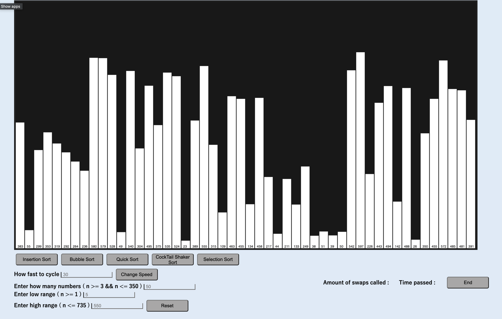
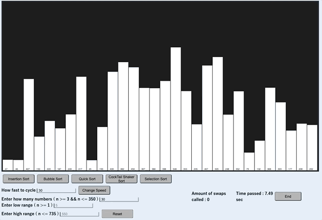
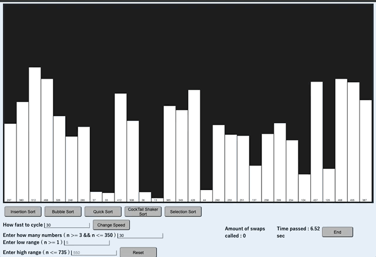

# Visual-Sorting-algo

## Description

Build on HTML canvas rendering different towers of different lengths based on user input
Currently contains methods for [Insertion](#insertion-sort), [Bubble](#bubble-sort), [CockTail Shaker](#cocktail-shaker-sort), [Quick](#quick-sort) and [Selection](#selection-sort) sort                                                   
User is allowed to enter the high and low end ranges, adjust swap speed and change the amount of towers to sort

## Screenshot

## Quick Sort

  Quick sort works by picking a 'pivot' value from the array and placing all other values in sorted order with respect to the pivot value. This process is then       repeated with the sections that are now divided with respect to the initial pivot value.

## Insertion Sort

Insertion sort works with 2 sub arrays from the input array. One being sorted at all times with values 'inserted' into it from the other array. As the array is traversed the value at the current iteration is then moved back in the sorted sub array until it is in it's right position.

## Cocktail Shaker Sort

Cocktail Shaker works similar to bubble sort with a value picked on the pass back through the array with the smallest value found and swapped until either at the beginning of the array or a smaller value is found.

## Selection Sort

Selection sort works with 2 sub arrays from the input array. One being sorted at all times with values placed at the end as they are found by traversing the unsorted half of the array. A pass is made on the unsorted sub array and you keep track of the smallest value to then swap into the sorted sub array.

## Bubble Sort

Bubble sort works by traversing the input array and swaps any values that are out of place. Any value that is greater than the current value you are on is selected and moved up the array until you either are at the end or a larger value is found. Once at the end of the array if any values have ben swapped you traverse the array again until no swaps are performed and the array is sorted.
